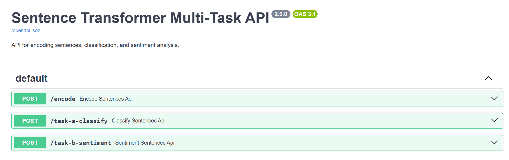
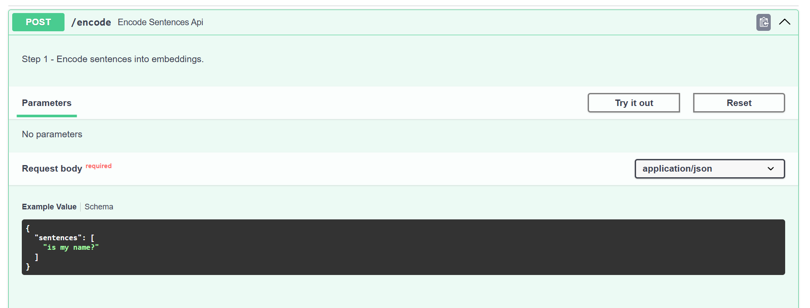

# Sentence Transformer(s) & Multi-Task Learning


## About Me: 

This project implements a sentence transformer model that encodes input sentences into fixed-length embeddings. 
The applications of such sentence transformers could be for tasks such as semantic chunking, text similarity, etc...

**Input:** a sentence/string. 

**Output:** a fixed-size numerical embedding vector for each sentence.

**Model:** all-MiniLM-L6-v2 (https://huggingface.co/sentence-transformers/all-MiniLM-L6-v2)

The application uses Docker as well as FastAPI with a Swagger page to allow for easy testing.   


## Quick Start:

Recommended to be run in Python 3.11, as dependencies are configured to that version. There are two possible ways to 
start the application. Either through Docker (recommended) or through command line python commands. 

### 1A. To run using Docker: 
```commandLine
docker-compose up --build
```

### 1B. To run using Python: 
```commandline
pip install -r requirements.txt
python app/main.py
uvicorn api:app --reload
```

### 2. FastAPI Swagger interface: 
In your browser navigate to: ```http://localhost:8000/docs#/```, it should look like this: 

In each endpoint you can test each task individually by expanding the endpoint, selecting "Try it Out", then inputting 
a sentence value to replace the existing "sentence" default value. The request will need to be in valid JSON so ensure
that quotes and curly braces are in the correct place!


There is also an optional dimension field. The default dimensions is 384, but if the user specifies a dimension, the
program will project embeddings before feeding them into the models. This is a simple compression, so it's not 
semantically perfect. If I were to want to use a better dimension reduction, I would use PCA in order to perform it. 

### 3. Running the test file: 
```commandline
python test.py
```

## Deep Dive into Task 1:
I implemented a sentence transformer model, encoding input sentences into fixed-length dense embeddings. I used a 
pre-trained model named all-MiniLM-L6-v2 through the SentenceTransformer library. This library automatically tokenizes
the text, passes it into the Transformer model, then applies mean pooling to produce the single vector. 

I also implemented a dynamic projection layer (nn.Linear) that would allow users to choose embedding dimensions outside
of the default 384. Again, this is a simple projection and a more robust solution like PCA would be something I would 
recommend for scalability. 

## Deep Dive into Task 2:
Using the encodings from the last part, a custom MultiTaskModel was implemented. If the request came from Task A, then 
the logits correspond to predefined classes. If task b, then the logits correspond to sentiment logits. I chose 
sentiment analysis as it's a single-label classification task. In the tests I performed, I asked it to ask if a provided
sentence can be categorized as positive or negative. With the small, more lightweight model I used, sentiment analysis 
fit the specifications more. 

I chose to use parallel interface during the single foward pass, so the model can compute both tasks simultaneously, 
helping efficiency. I tried making the designs as scalable as possible with helper methods. By using random seeds, the 
user has the flexibility to achieve their custom deterministic results. 


## Tests (all found in test.py)

### Test One: 
**Sentence:** Soccer is pretty cool!

**Embedding Dimensions:** torch.Size([384])

**Embedding Snippet:** tensor([ 0.0160, -0.0027,  0.0100, -0.0184,  0.0123])...

**Task A Classification:** Sports

**Task B Sentiment:** Positive


### Test Two: 
**Sentence:** Hello Fetch!

**Embedding Dimensions:** torch.Size([384])

**Embedding Snippet:** tensor([-0.0812,  0.0256,  0.0376,  0.0185, -0.0956])...

**Task A Classification:** Greetings

**Task B Sentiment:** Positive


### Test Three: 
**Sentence:** The weather is so gloomy!

**Embedding Dimensions:** torch.Size([384])

**Embedding Snippet:** tensor([ 0.0506,  0.0659,  0.1175,  0.1304, -0.0093])...

**Task A Classification:** Weather

**Task B Sentiment:** Negative


## Task Three:
### Part One: 

**1. The entire network should be frozen:**
This would mean that the sentence transformer and multi-task model don't have some form of dynamic weight updating. The
advantages to this would be that there's no gradient computation, making it faster and with lower memory usage. However, 
this would result in more inaccurate results and a lack of being able to adapt to new tasks. Tasks such as fine-tuning 
would be extremely difficult. I believe this should only be used if the tasks are very specific and the model is built 
only for the tasks and data trained on. 

**2. If only the transformer backbone should be frozen:**
This would mean that the sentence transformer is the only thing that's frozen, but the multi-task model (Task A and B) 
are both still trainable. This would provide us the faster training speed than if everything was dynamic. It would also 
allow for the specific fine-tuning for our own purposes but allow for a fixed encoder sentence transformer. However, 
there could be performance issues if the pre-trained encoder embeddings don't match up with the task it's provided. An 
example would be if the sentence had something to do with cats and the categories were all about sports in German. In 
this example, if the underlying language domain is the same (both English), and the "downstream" tasks are different, 
it would be valid. 

**3. If only one of the task-specific heads (either for Task A or Task B) should be frozen:**
If Task A was very well trained and performing well and Task B is suffering, then this is an example of when Task A 
is recommended to be frozen and Task B should be fine-tuned. This could also be used when one task changes, but the 
other should retain the previous accuracy. An example would be if we changed Task B to NLP. 


## Task Four: 
*Task Four can be found in the separate test_task4.py file!*
I made a couple of assumptions. The first being that the sentence transformer is sufficient for both tasks. Instead of 
writing a custom encoder for each of them. This is a MTL approach, as we are making the assumption that the tasks will 
not suffer from shared feature representations. We also assume that sentence classification and sentiment analysis are 
mutually beneficial, especially given the predetermined classes. I also summed the two task losses equally without any 
special weighting. In the real world, more computational would need to be done to treat the weight losses differently, 
as it can be pretty rare to have the importance of both be 50/50. 

I also froze the sentence transformer and only focused on training the two tasks. To help improve the efficiency and as 
the predetermined questions are both in English and hopefully high enough quality (also to reduce overfitting). Then in 
a forward pass, the sentences are encoded once and the outputs are computed separately. Then I calculated the cross 
entropy loss (as these are both classification tasks). I combined the losses and asked the model to minimize the sum. 
Again, in a real world example, the loss functions would be need to be treated differently depending on task performance, 
maybe only one needs to be trained more than the other. Or some form of dynamic task weighing could be implemented. 


